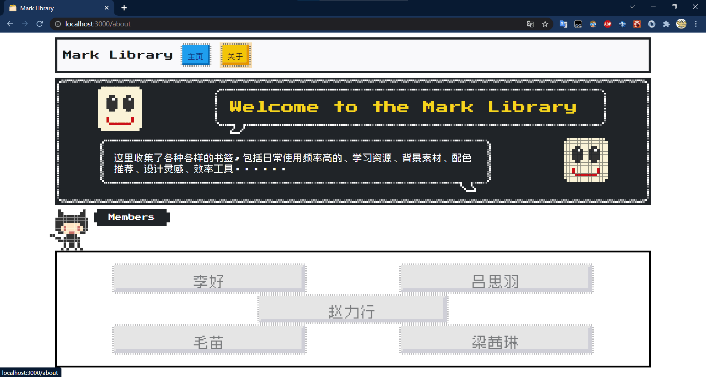

<h1 align="center">
  <a href="https://github.com/n1ckzhao/mark-library">
    <!-- Please provide path to your logo here -->
    
  </a>
</h1>

<div align="center">
  Mark-Library
  <br />
  <a href="#about"><strong>Explore the screenshots »</strong></a>
  <br />
  <br />
  <a href="https://github.com/n1ckzhao/mark-library/issues/new?assignees=&labels=bug&template=01_BUG_REPORT.md&title=bug%3A+">Report a Bug</a>
  ·
  <a href="https://github.com/n1ckzhao/mark-library/issues/new?assignees=&labels=enhancement&template=02_FEATURE_REQUEST.md&title=feat%3A+">Request a Feature</a>
  .
  <a href="https://github.com/n1ckzhao/mark-library/issues/new?assignees=&labels=question&template=04_SUPPORT_QUESTION.md&title=support%3A+">Ask a Question</a>
</div>

<div align="center">
<br />

[](LICENSE)

[](https://github.com/n1ckzhao/mark-library/issues?q=is%3Aissue+is%3Aopen+label%3A%22help+wanted%22)
[](https://github.com/n1ckzhao)

</div>

<details open="open">
<summary>Table of Contents</summary>

- [About](#about)
  - [Built With](#built-with)
- [Getting Started](#getting-started)
  - [Prerequisites](#prerequisites)
  - [Installation](#installation)
- [Usage](#usage)
- [Roadmap](#roadmap)
- [Project assistance](#project-assistance)
- [Contributing](#contributing)
- [Authors & contributors](#authors--contributors)
- [Security](#security)
- [License](#license)
- [Acknowledgements](#acknowledgements)

</details>

---

## About

> This is a creative competition entry for [caai](http://mit.caai.cn/).

Have a imagine! When you go out and your pc is not with. So you find a public computer, but you want to access your saved marks and you do not want to log in.

This is a mark library that can render your own marks list on the browser.

<details>
<summary>Screenshots</summary>
<br>


|                            Home Page                             |                            About Page                             |
| :--------------------------------------------------------------: | :---------------------------------------------------------------: |
|  |  |

</details>

### Built With

- [React](https://github.com/facebook/react)
- [Flask](https://github.com/pallets/flask)
- [Axios](https://github.com/axios/axios)
- [MySQL](https://github.com/mysqljs/mysql)
- [NES.CSS](https://github.com/nostalgic-css/NES.css)
- [Bootstrap](https://github.com/twbs/bootstrap)

## Getting Started

### Prerequisites

Make sure you have installed `node.js`, `python 3.7` and `pipenv`.

### Installation

1. Download the project.
2. Use npm to install required package.

```sh
npm install
```

3. Use pipenv to install back-end enviroment.

```sh
pipenv install
```

## Usage

1. Run command in folder back-end:

```sh
pipenv run app.py
```

> Dont forget ckeck the database properties and make sure it is correct in file `app.py`. 2. Run command in folder front-end:

```sh
npm start
```

## Roadmap

See the [open issues](https://github.com/n1ckzhao/mark-library/issues) for a list of proposed features (and known issues).

- [Top Feature Requests](https://github.com/n1ckzhao/mark-library/issues?q=label%3Aenhancement+is%3Aopen+sort%3Areactions-%2B1-desc) (Add your votes using the 👍 reaction)
- [Top Bugs](https://github.com/n1ckzhao/mark-library/issues?q=is%3Aissue+is%3Aopen+label%3Abug+sort%3Areactions-%2B1-desc) (Add your votes using the 👍 reaction)
- [Newest Bugs](https://github.com/n1ckzhao/mark-library/issues?q=is%3Aopen+is%3Aissue+label%3Abug)

## Project assistance

If you want to say **thank you** or/and support active development of mark-library:

- Add a [GitHub Star](https://github.com/n1ckzhao/mark-library) to the project.
- Tweet about the mark-library.
- Write interesting articles about the project on [Dev.to](https://dev.to/), [Medium](https://medium.com/) or your personal blog.

Together, we can make mark-library **better**!

## Contributing

First off, thanks for taking the time to contribute! Contributions are what make the open-source community such an amazing place to learn, inspire, and create. Any contributions you make will benefit everybody else and are **greatly appreciated**.

Please read [our contribution guidelines](docs/CONTRIBUTING.md), and thank you for being involved!

## Authors & contributors

The original setup of this repository is by [Nick Zhao](https://github.com/n1ckzhao).

For a full list of all authors and contributors, see [the contributors page](https://github.com/n1ckzhao/mark-library/contributors).

## Security

mark-library follows good practices of security, but 100% security cannot be assured.
mark-library is provided **"as is"** without any **warranty**. Use at your own risk.

_For more information and to report security issues, please refer to our [security documentation](docs/SECURITY.md)._

## License

This project is licensed under the **MIT license**.

See [LICENSE](LICENSE) for more information.

## Acknowledgements

- [caai](http://mit.caai.cn/)
