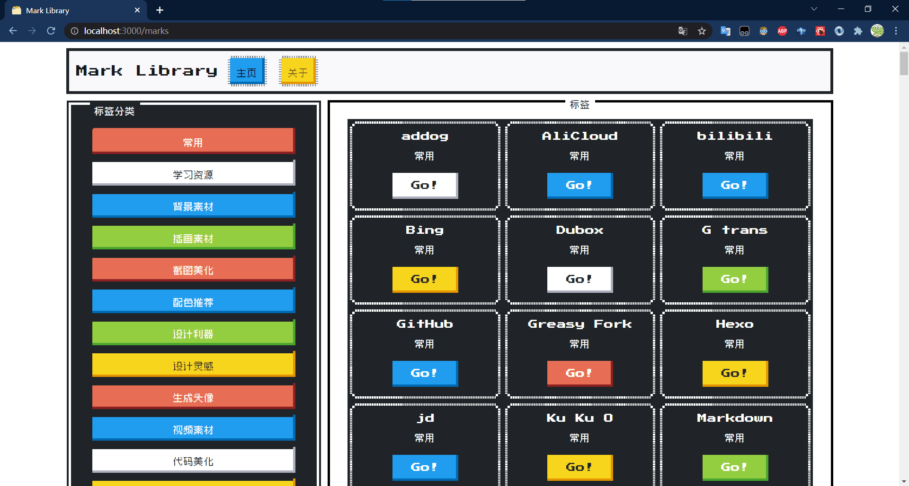
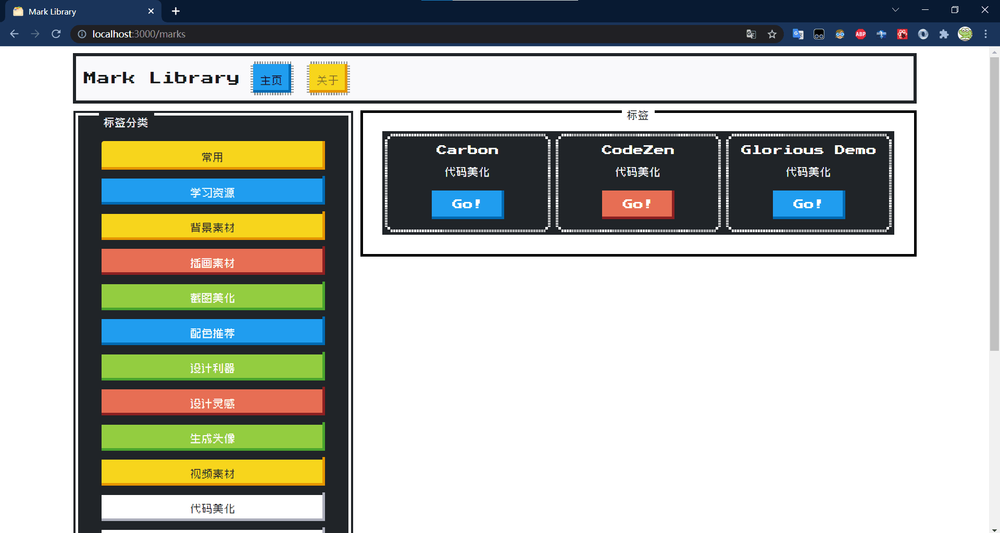
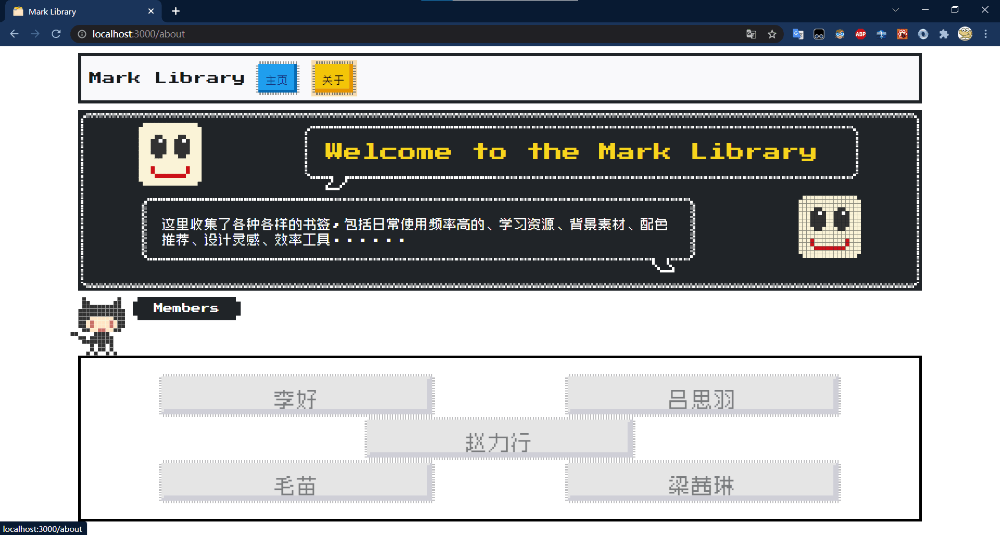

# 作品介绍文档

## 作品开发平台

- 操作系统:Windows10
- 前端:[
  - IDE:`Visual Studio Code`
  - js 框架:`React`
  - css 框架:`nes-css`
  - 网络库:`axios`
  - 测试工具:`postman`
    ]
- 后端:[
  - `Python 3.7`
  - 库:
  - `Flask`
  - `flask-restful`
  - `flask-sqlalchemy`
  - `flask-cor`
  - IDE:`Visual Studio Code`
  - 测试工具:`postman`
    ]
- 数据库:`MySQL 8.0`
- 数据可视化工具:`MySQL Workbench`

## 主要软件

- JavaScript
- Python
- React
- Flask
- Visual Studio Code

## 操作方法

启动:

1. 进入后端项目文件夹
2. `pipenv install`
3. `pipenv run app`
4. 进入前端项目文件夹
5. `npm install`
6. `npm start`
7. 打开浏览器访问 http://localhost:3000

## 作品亮点与特色

这是一个"产品/设计师/独立开发者的资源库"  
其中收集了大量的网站,包括学习资源/背景素材/插画素材/截图美化...等等分类的资源站点,为的是产品/设计师/独立开发者们在创造/开发/设计自己作品的过程中能够轻松获取灵感/素材.  
在技术方面,使用了前沿技术 React 作为前端界面的渲染.  
数据库中的数据来源于长期的收集/积累.
